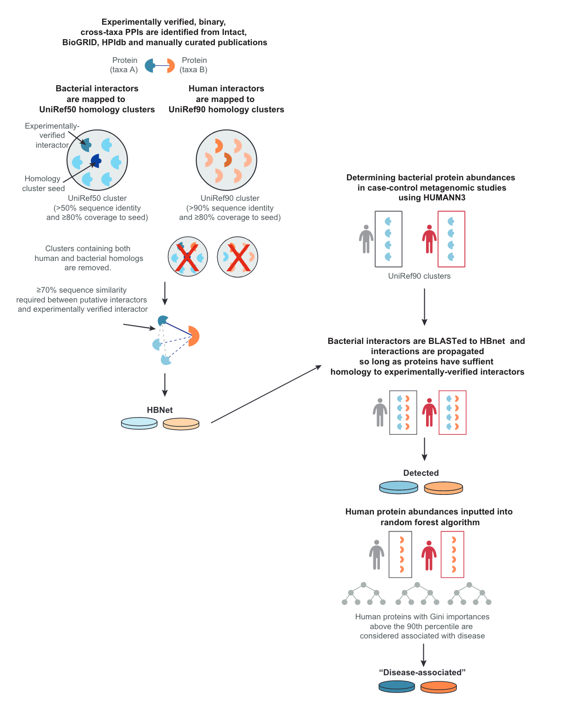

```{r setup, include=FALSE}
knitr::opts_chunk$set(
  echo = TRUE,
  results = "markup",
  error = FALSE,
  warning = FALSE,
  message = FALSE,
  collapse = TRUE
)
```

# 0. Initialisation de l'environnement de travail

Choisir le répertoire de travail. En plus de ce `.Rmd`, il doit contenir dans un répertoire 'data' les fichiers:

-   `zhou2022_list_ppi.txt` venant de la publi de méthode,

-   `acne_all_genefamilies.tsv` venant de la publi de métagénomique (fourni par Alban),

-   `uniref50.xml`, `uniref90.xml`, `uniref100.xml` venant des archives d'UniProt (on veut se servir de la snapshot de janvier 2019 pour être cohérent avec HUMAnN3).

```{r workspace, eval=FALSE}
setwd("/home/fonell01/github/multilayer-skin")
```

Les modules nécessaires sont les suivants:

```{r dependencies}
# Général
library(reticulate)
library(tidyverse)
library(readr)

# Web APIs
library(myTAI)
#library(UniProt.ws)
#library(httr)
#library(jsonlite)
#library(biogridr)
# source("rest_functions.R")
```

# 1. Création de la base de données "HBNet"

En suivant le protocole de [Zhou et al. (2022)](https://doi.org/10.1186/s13059-022-02643-9), nous voulons créer une base de données d'interactions PPIs humain - bactérie/fungus, où les identifiants ne sont pas des protéines mais des clusters d'homologie UniRef, afin de propager les PPIs aux protéines proches structurellement. Les informations de cette base de données sont ensuite utilisées pour traiter les données métagénomiques de cohortes sur l'acné (ou d'autres maladies cutanées).



## a. Listes de PPI venant de Zhou et al. (2022)

Voir **Additional file 9: Table S8** de la publication. Le fichier contient les IDs UniProt des PPIs inter-spécifiques, avant tout filtre ou mapping vers UniRef. Les interactions proviennent de diverses grosses bases de données, ainsi que de publications (text mining manuel).

```{r zhou_to_df}
zhou_ppi <- read_tsv("data/zhou2022_list_ppi.txt")

# Data Wrangling
zhou_ppi <- zhou_ppi %>%
  mutate(
    interactor_1 = str_extract(Experimental_Interaction, "\\w+"),
    interactor_2 = str_extract(Experimental_Interaction, "(?<=', ')[A-Z0-9]+"),
    publications = str_remove_all(publications, "\\{|\\}|'") # Expressions régulières proposées par chatGPT
  ) %>%
  dplyr::select(interactor_1, interactor_2, db, publications) # On ne garde que les deux premiers IDs d'interacteurs

zhou_ppi[1:3,]
```

On se crée une liste des protéines uniques dans les interactions, qu'on va chercher à annoter avec les données d'UniProt.

```{r zhou_quality_check}
unique_interactors <- data.frame(
  From = unique(c(zhou_ppi$interactor_1, zhou_ppi$interactor_2)),
  stringsAsFactors = FALSE
)

nrow(unique_interactors)
```

On écrit cette liste dans un fichier pour l'importer sur [UniProt](https://www.uniprot.org/id-mapping) pour obtenir les champs supplémentaires qui nous intéressent.

```{r write_to_file}
writeLines(unique_interactors$From, "data/unique_interactors.txt")
```

## b. Ajout des métadonnées UniProt nécessaires

Sur l'outil **ID mapping** d'UniProt on fait UniProtKB AC/ID -\> UniProtKB. On exporte ensuite sous format tabulé, avec les colonnes suivantes:

```{r exported_mapping}
unique_interactors <- read_tsv("data/idmapping_taxonomy.tsv")

length(unique_interactors$From) # Devrait être la même que précédemment
unique_interactors[1:3,]
```

On peut déjà remarquer que certaines espèces sont sur-représentées dans les PPIs (*Yersinia pestis* par exemple). Les PPIs inter-spécifiques ont été bien plus étudiées chez les pathogènes que les commensaux. C'est un biais possible, mais on postule que l'élargissement des PPIs par homologie de séquence suffit à le contourner.

```{r top_species_plot, echo=FALSE}

biggest_10_species <- data.frame(sort(table(unique_interactors$Organism), decreasing = TRUE)[1:10]) %>%
  setNames(c("Species", "Occurences"))

ggplot(biggest_10_species, aes(x=Species, y=Occurences)) +
  geom_segment( aes(x=Species, xend=Species, y=0, yend=Occurences), color="skyblue") +
  geom_point( color="blue", size=4, alpha=0.6) +
  theme_light() +
  coord_flip() +
  ylab("Occurences (log10)") +
  scale_y_continuous(trans = "log10") +
  theme(
    panel.grid.major.y = element_blank(),
    panel.border = element_blank(),
    axis.ticks.y = element_blank()
  )

remove(biggest_10_species)
```

En se basant sur la colonne **taxonomic lineage**, on détermine le taxon d'où provient la protéine. Au final, on ne s'intéresse qu'aux protéines humaines, bactériennes et fongiques de notre système peau.

```{r add_taxonomy}

get_taxon <- function(organism_id, lineage) {
  taxon <- NA
  if (!is.na(organism_id) && organism_id == "9606") {
    taxon = "human"
  }
  else if (!is.na(lineage) && grepl("2 (superkingdom)", lineage, fixed = TRUE)) {
    taxon = "bacteria"
  }
  else if (!is.na(lineage) && grepl("10239 (superkingdom)", lineage, fixed = TRUE)) {
    taxon = "virus"
  }
  else if (!is.na(lineage) && grepl("33208 (kingdom)", lineage, fixed = TRUE)) {
    taxon = "metazoa"
  }
  else if (!is.na(lineage) && grepl("4751 (kingdom)", lineage, fixed = TRUE)) {
    taxon = "fungi"
  }
  else if (!is.na(lineage) && grepl("33090 (kingdom)", lineage, fixed = TRUE)) {
    taxon = "plantae"
  }
  else if (!is.na(lineage) && grepl("2759 (superkingdom)", lineage, fixed = TRUE)) {
    taxon = "eukaryota"
  }
  else if (!is.na(lineage) && grepl("2157 (superkingdom)", lineage, fixed = TRUE)) {
    taxon = "archaea"
  }
  return(taxon)
}

unique_interactors$taxon <- mapply(
  get_taxon,
  unique_interactors$`Organism (ID)`,
  unique_interactors$`Taxonomic lineage (Ids)`
)
```

```{r taxo_groups_plot, echo=FALSE}
taxons_table <- data.frame(sort(table(unique_interactors$taxon), decreasing = TRUE)) %>%
  setNames(c("Group", "Occurences"))

ggplot(taxons_table, aes(x=Group, y=Occurences)) +
  geom_segment( aes(x=Group, xend=Group, y=0, yend=Occurences), color="skyblue") +
  geom_point( color="blue", size=4, alpha=0.6) +
  theme_light() +
  coord_flip() +
  #ylab("Occurences (log10)") +
  #scale_y_continuous(trans = "log10") +
  theme(
    panel.grid.major.y = element_blank(),
    panel.border = element_blank(),
    axis.ticks.y = element_blank()
  )

remove(taxons_table)
                           
```

Ces groupes sont exclusifs (metazoa contient tous les animaux excepté l'humain, et eukaryota exclut human+metazoa+fungi+plantae).

## c. Mapping des protéines vers leur cluster UniRef (2019-01)

Pour éviter des incohérences avec les données métagénomiques passées par HUMAnN3, on mappe les protéines aux clusters d'UniRef 2019-01, plutôt qu'utiliser la base de donnée UniRef qui est en ligne aujourd'hui. En effet, si les IDs d'accessions UniProt sont assez stables, ce n'est pas le cas des IDs de clusters UniRef. On se retrouve avec 60% de mapping quand on essaie de mapper les UniRef90 issus de HUMAnN3 (2019) à UniRef50 (2023). En prévention, on doit donc construire notre base de données PPI "HBNet" avec UniRef 2019-01. Le téléchargement se fait [ici](https://ftp.uniprot.org/pub/databases/uniprot/previous_releases/release-2019_01/uniref/).

Avec le script bash suivant, on crée une table de mapping **UniProt -\> UniRef et LCA** (Last Common Ancestor). L'exemple se fait avec uniref50.xml mais il faut le faire avec les 3 (50/90/100).

```{bash uniref_mapping_table, eval=FALSE}
#!/bin/bash

# Assigner variable pour chemin du fichier en entrée:
fichier_in="data/uniref50.xml" #50/90/100
fichier_out="data/mapping_taxo_ref50.tsv"
fichier_sorted="data/sorted_mapping_taxo_ref50.tsv"

# Crée à partir d'uniref50.xml une table de mapping entre les identifiants
# UniProtKB (colonne 1) et les identifiants UniRef50 (colonne 2).
last_uniref_id=""
last_lca_id=""
grep -E "<entry|<property type=\"UniProtKB accession\"|<property type=\"common taxon ID\"" "$fichier_in" |
awk -F '"' '{
  if ($0 ~ /^<property type="common taxon ID"/) {
    if ($4 ~ /^[0-9]+$/) {
      last_lca_id=$4
    }
  } else if ($0 ~ /^<entry id=/) {
    last_uniref_id=$2
  } else {
    print $4 "\t" last_uniref_id "\t" last_lca_id
  }
}' > "$fichier_out"

# Pour 141M de lignes, le tri a pris 7mn sur le serveur.
sort -t $'\t' -k1,1 "$fichier_out" > "$fichier_sorted"
```

On obtient une table triée de la forme:

| UniProt | UniRef              | Last Common Ancestor (TaxID) |
|---------|---------------------|------------------------------|
| A0A000  | UniRef50_A0A221P444 | 2                            |
| A0A001  | UniRef50_D5SLG9     | 1883                         |
| A0A002  | UniRef50_D5SLH0     | 1883                         |
| A0A003  | UniRef50_D5SLH1     | 1883                         |
| A0A004  | UniRef50_A0A1A9QNL0 | 1760                         |
| ...     | ...                 | ...                          |

Notre table contient 130M de lignes (tout UniProt!). On veut filtrer pour avoir seulement les 8937 interacteurs qui nous intéressent. On se sert de l'utilitaire **sgrep** ([SourceForge](https://sourceforge.net/projects/sgrep/)) qui utilise la recherche dichotomique pour trouver rapidement les 8,937 lignes au sein des 141M de lignes triées.

Encore une fois, éditer le script pour le faire aussi sur UniRef90/100.

```{bash dichotomic_filter, eval=FALSE}
#!/bin/bash

# Chemin vers le fichier TSV trié
sorted_tsv="data/sorted_mapping_taxo_ref50.tsv"

# Liste des identifiants UniProt à rechercher
identifiers_file="data/unique_interactors.txt"

# Chemin vers l'exécutable sgrep
sgrep_executable="sgrep"

# Fichier de sortie pour écrire les lignes correspondantes
output_file="data/mapped_interactors_ref50.tsv"

# Boucle pour lire chaque identifiant du fichier et effectuer la recherche avec sgrep
if [ -f "temp_$output_file" ]; then
  rm "temp_$output_file"
fi
while read -r identifier; do
  line=$( "$sgrep_executable" "$identifier" "$sorted_tsv" )
  if [ -n "$line" ]; then
    echo "$line" >> "temp_$output_file"
  fi
done < "$identifiers_file"

# Comme sgrep ne supporte pas les regex, on a récupéré toutes les lignes dont le début matche.
# On doit donc filtrer les lignes qui ne matchent pas exactement en utilisant grep.
# On exclue les lignes qui contiennent "-" dans la colonne 1.
grep -P "^[A-Z0-9]+\t" "temp_$output_file" > "$output_file"
rm "temp_$output_file"
```

On importe notre liste d'interacteurs uniques, mappés sur UniRef50/90/100, dans l'environnement R.

```{r}
make_colnames <- function(uniref_db) {
  columns = c(
    "From",
    paste0("Cluster_", uniref_db),
    paste0("Taxo_LCA_", uniref_db)
  )
  return(columns)
}

mapped_interactors_uniref <- merge(
  merge(
    read_tsv("data/mapped_interactors_ref50.tsv", col_names = make_colnames("UniRef50")),
    read_tsv("data/mapped_interactors_ref90.tsv", col_names = make_colnames("UniRef90")),
    by = "From"
  ),
  read_tsv("data/mapped_interactors_ref100.tsv", col_names = make_colnames("UniRef100")),
  by = "From"
)

# Statistiques
paste(
  nrow(mapped_interactors_uniref), # Nombre de matches avec les bases UniRef
  round(
    nrow(mapped_interactors_uniref) / nrow(unique_interactors),
    digits = 2
  ) # Fraction mappée
)

mapped_interactors_uniref[1:3,]

# On ajoute les résultats de ce mapping au dataframe principal
unique_interactors <- merge(
  unique_interactors,
  mapped_interactors_uniref,
  by = "From",
  all = TRUE
)
```

## d. Filtres pour ne garder que les interacteurs d'intérêt 

On veut maintenant filtrer sur la taxonomie. Tout d'abord, filtrons pour ne garder que les interacteurs humains, bactériens et fongiques.

```{r keep_only_hbf}
hbf_interactors <- unique_interactors %>%
  filter(taxon %in% c("human", "bacteria", "fungi") & !is.na(Cluster_UniRef50))

nrow(hbf_interactors)
```

On filtre pour ne garder que les clusters 100% humains, 100% bactériens et 100% fongiques.

On peut profiter du fait qu'on sait déjà que le cluster contient une protéine du taxon d'intérêt. Un exemple: dans le pire des cas pour un interacteur de bactérie, le LCA pourra être "root" ou "cellular organisms" s'il n'y a pas que des bactéries dans le cluster.

Pour les larges taxons *bacteria* et *fungi*, on exclue donc le cluster si le LCA est au dessus du taxons (la liste de parents est courte heureusement). Pour les clusters *human*, on a juste à vérifier que le LCA est 9606.

```{r keep_only_homogen}
# lca_to_remove_bacteria <- c("root", "cellular organisms")
lca_to_remove_bacteria <- c(1, 131567)
# lca_to_remove_fungi <- c("root", "cellular organisms", "Eukaryota", "Opisthokonta")
lca_to_remove_fungi <- c(1, 131567, 2759, 33154)

hbf_homogen_clusters <- hbf_interactors %>%
  filter(taxon != "human" | Taxo_LCA_UniRef90 == "9606" | Taxo_LCA_UniRef100 == "9606") %>%
  filter(!(taxon == "bacteria" & Taxo_LCA_UniRef50 %in% lca_to_remove_bacteria)) %>%
  filter(!(taxon == "fungi" & Taxo_LCA_UniRef50 %in% lca_to_remove_fungi))
```

\_\_\_\_\_\_\_\_

Pour la suite on utilise Entry plutôt que From, car les UniProt IDs de Entry sont ceux à jour.

```{r}
writeLines(unique_interactors$Entry, "data/unique_interactors_updated.txt")
```

Sur UniProt, on lance 3 jobs d'ID mapping allant des IDs de `unique_interactors` vers UniRef100, UniRef90 et UniRef50. On filtre les résultats avec le bouton "filter by taxonomy" en haut à gauche pour garder seulement les mapping vers des clusters contenant de l'humain pour UniRef100/90, et contenant bacteria ou contenant fungi pour UniRef50. On exporte au format tsv.

Ce premier filtre ne garde pas que les clusters contenant UNIQUEMENT le taxon d'intérêt, mais ceux ayant au moins 1 du taxon d'intérêt. Néanmoins cela nous simplifie le travail pour filtrer. Par exemple pour bacteria, on a seulement à exclure dans R les clusters ayant "root" ou "cellular organisms" en LCA. Pour fongi, on exclut les deux précédents ainsi que "eucaryota" et "opisthokonta". Pour l'humain, on ne garde le cluster que si le LCA est "human".

**Notes:**

-   Certains clusters UniRef100 ne peuvent pas être étendus à Uniref90 ou Uniref50. Peut-être donc que si pour bactérie et champignon on ne map pas sur Uniref50 on devrait tenter de se rabattre sur Uniref90 puis Uniref100 ?

-   Fallait-il vraiment filtrer à "100% du cluster correspond à l'espèce" ? En relisant le papier, ce qu'ils ont fait n'est pas si clair.

```{r add_uniref}
uniref100_human <- read_tsv("data/uniref100_human.tsv")
uniref90_human <- read_tsv("data/uniref90_human.tsv")
uniref50_bacteria <- read_tsv("data/uniref50_bacteria.tsv")
uniref50_fungi <- read_tsv("data/uniref50_fungi.tsv")

# lca_to_remove <- c("root", "cellular organisms", "Eukaryota", "Opisthokonta")
lca_to_remove <- c(1, 131567, 2759, 33154)
uniref100_onlyhuman <- uniref100_human %>% filter(`Common taxon ID` == 9606)
uniref90_onlyhuman <- uniref90_human %>% filter(`Common taxon ID` == 9606)
uniref50_onlybacteria <- uniref50_bacteria %>%
  filter(!(`Common taxon ID` %in% lca_to_remove))
uniref50_onlyfungi <- uniref50_fungi %>%
  filter(!(`Common taxon ID` %in% lca_to_remove))

# Ajouter les clusters à unique_interactors SEULEMENT SI celui-ci ne contient que des bactéries ou que des humains
unique_interactors <- unique_interactors %>%
  mutate(
    homogen_cluster = ifelse(
      taxon == "bacteria" & Entry %in% uniref50_onlybacteria$From,
      uniref50_onlybacteria$`Cluster ID`[match(Entry, uniref50_onlybacteria$From)],
      ifelse(
        taxon == "fungi" & Entry %in% uniref50_onlyfungi$From,
        uniref50_onlyfungi$`Cluster ID`[match(Entry, uniref50_onlyfungi$From)],
        ifelse(
          taxon == "human" & Entry %in% uniref90_onlyhuman$From,
          uniref90_onlyhuman$`Cluster ID`[match(Entry, uniref90_onlyhuman$From)],
          ifelse(
            taxon == "human" & Entry %in% uniref100_onlyhuman$From,
            uniref100_onlyhuman$`Cluster ID`[match(Entry, uniref100_onlyhuman$From)],
            NA_character_
          )
        )
      )
    ),
    identity = as.integer(str_extract(homogen_cluster, "(?<=UniRef)\\d+")) #50, 90, 100
  )

rm(uniref100_human, uniref90_human, uniref50_bacteria, uniref50_fungi,
   uniref100_onlyhuman, uniref90_onlyhuman, uniref50_onlybacteria, uniref50_onlyfungi,
   lca_to_remove
)
```

On met à jour les IDs UniProt de 2021 (publication) qui ont été "merged" depuis.

```{r merged_id}
zhou_ppi$interactor_1 <- sapply(
  zhou_ppi$interactor_1,
  function(x) {
    with(unique_interactors, Entry[From==x])
  }
)

zhou_ppi$interactor_2 <- sapply(
  zhou_ppi$interactor_2,
  function(x) {
    with(unique_interactors, Entry[From==x])
  }
)
```

Ajoutons les taxons au PPIs de \`zhou_ppi\`, et filtrons les PPI bactérie-humain ou humain-fungi.

```{r human_bacteria_filter}
zhou_ppi$taxon_1 <- sapply(
  zhou_ppi$interactor_1,
  function(x) {
    with(unique_interactors, taxon[Entry==x])[1]
  }
)

zhou_ppi$taxon_2 <- sapply(
  zhou_ppi$interactor_2,
  function(x) {
    with(unique_interactors, taxon[Entry==x])[1]
  }
)

zhou_ppi$ppi_taxons <- paste(zhou_ppi$taxon_1, zhou_ppi$taxon_2, sep=",")

zhou_ppi$cluster_1 <- sapply(
  zhou_ppi$interactor_1,
  function(x) {
    with(unique_interactors, homogen_cluster[Entry==x])
  }
)

zhou_ppi$cluster_2 <- sapply(
  zhou_ppi$interactor_2,
  function(x) {
    with(unique_interactors, homogen_cluster[Entry==x])
  }
)

table(zhou_ppi$ppi_taxons)

coupled_columns <- list(
  c("interactor_1", "interactor_2"),
  c("taxon_1", "taxon_2"),
  c("cluster_1", "cluster_2")
)

skin_ppi <- zhou_ppi %>% 
  filter(!is.na(cluster_1) & !is.na(cluster_2)) %>%
  mutate(to_switch = if_else(taxon_1!='human', TRUE, FALSE))

for (columns in coupled_columns) {
  skin_ppi[which(skin_ppi$to_switch), columns] <- 
    rev(skin_ppi[which(skin_ppi$to_switch), columns])
}
```

`skin_ppi` contient les PPIs sur lesquelles un mapping est possible. On mappe sur les clusters.

# 2. Données métagénomiques sur l'acné

## a. Données métagénomiques

Alban a donné `data/acne_all_genefamilies.tsv`, qui contient les abondances de protéines (clusters UniRef) pour les cohortes acné et sain issus de Barnard et al. (2016).

```{r barnard_genefamilies}

barnard_genefamilies <- read_tsv("data/acne_all_genefamilies.tsv")

smaller_barnard <- barnard_genefamilies[!grepl("\\|", barnard_genefamilies$`# Gene Family`), ]
smaller_barnard <- smaller_barnard[-1,] # enlever UNMAPPED
smaller_barnard$`# Gene Family` <- substr(
  smaller_barnard$`# Gene Family`,
  start = 10,
  stop = nchar(smaller_barnard$`# Gene Family`)
) # enlever "UniRef90_"
```

```{r}
frac_size <- 100000
n_files <- nrow(smaller_barnard) %/% frac_size + 1

for (i in 1:n_files) {
  low_bound <- (i - 1) * frac_size + 1
  up_bound <- min(i*frac_size, nrow(smaller_barnard))
  frac_barnard <- smaller_barnard$`# Gene Family`[low_bound:up_bound]
  writeLines(frac_barnard, paste0("data/barnard_ref90_2019_", i, ".txt"))
}

rm(frac_size, n_files)
```

On mappe sur UniProt **(UniProtKB_AC-ID → UniRef50)**. Malheureusement, énormément d'IDs ne mappent pas. Il va peut-être falloir utiliser UniRef de 2019 pour être cohérent avec Humann3.

```{r barnard_uniref50_mapped, eval=FALSE}

barnard_uniref50_2023 <- rbind(
  read_tsv("data/barnard_ref50_2023_1.tsv"),
  read_tsv("data/barnard_ref50_2023_2.tsv"),
  read_tsv("data/barnard_ref50_2023_3.tsv"),
  read_tsv("data/barnard_ref50_2023_4.tsv"),
  read_tsv("data/barnard_ref50_2023_5.tsv"),
  read_tsv("data/barnard_ref50_2023_6.tsv")
)
colnames(barnard_uniref50_2023) <- c("# Gene Family", "Cluster ID")

print(
  paste(
    "Pourcentage de mapping réussi:",
    100 * nrow(barnard_uniref50_2023) / nrow(smaller_barnard)
  )
)
```

On veut ensuite calculer les "expositions" des protéines humaines en sommant les abondances des interacteurs bactériens de cette protéine, au sein du sample.

```{r human_prots_exposition, eval=FALSE}

# skin_ppi
# barnard_uniref50_2023
# smaller_barnard


smaller_barnard <- left_join(smaller_barnard, barnard_uniref50_2023, by = "# Gene Family") %>%
  relocate("# Gene Family","Cluster ID") %>%
  filter(!is.na(`Cluster ID`))

human_prot_exposition <- data.frame(
  stringsAsFactors = FALSE,
  matrix(
    ncol = length(colnames(smaller_barnard)) - 1,
    nrow = length(unique(skin_ppi$cluster_1))
  )
)

colnames(human_prot_exposition) <- c("uniref100", colnames(smaller_barnard)[-c(1:2)])

human_prot_exposition$uniref100 <- unique(skin_ppi$cluster_1)

# Vectoriser ces boucles si l'execution est trop lente. Ok pour l'instant.

# for (sample in colnames(human_prot_exposition)[-1]) {
#   for (human_prot in human_prot_exposition$uniref100) {
#     abundances <- smaller_barnard %>%
#       filter(`Cluster ID` == human_prot) %>%
#       pull(sample)
#     human_prot_exposition[human_prot_exposition$uniref100 == human_prot, sample] <- sum(abundances)
#   }
# }
  
```

\_\_\_\_\_\_\_\_\_\_\_\_\_\_\_\_\_\_\_\_\_\_\_\_\_\_\_\_\_\_\_\_\_\_\_\_\_\_\_\_\_\_\_\_\_\_\_\_\_\_\_\_\_

# [OLD]1. Building a putative bacteria‑human protein‑protein interaction (PPI) network

Il n'y a presque aucun PPI humain-bactérie dans biogrid

```{r biogrid_human, eval=FALSE}
biogrid <- read_tsv("data/BIOGRID-ALL-4.4.221.tab3.txt") %>%
  dplyr::select(
    "SWISS-PROT Accessions Interactor A",
    "SWISS-PROT Accessions Interactor B",
    "Organism Name Interactor A",
    "Organism Name Interactor B"
  ) %>%
  set_names("A", "B", "Species_A", "Species_B") %>%
  filter(
    (Species_A == "Homo sapiens" & Species_B != "Homo sapiens") |
    (Species_B == "Homo sapiens" & Species_A != "Homo sapiens")
  ) %>%
  filter(A != "-") %>%
  filter(B != "-") %>%
  filter(Species_B != "Mus musculus") %>%
  filter(Species_B != "Rattus norvegicus") %>% 
  filter(Species_B != "Saccharomyces cerevisiae (S288c)")
```

HPIDB

```{r hpidb, eval=FALSE}
hpidb <- read_tsv("data/hpidb_human_list.mitab_plus.txt")
interaction_type <- as.data.frame(table(hpidb$interaction_type))
detection_method <- as.data.frame(table(hpidb$detection_method))
```

Interactions were downloaded from the IntAct database, HPIdb 3.0, and BioGRID [June 2021] and supplemented with additional host-microbe interaction studies, whose interactions were added manually. Only interactions with evidence codes that indicated binary, experimental determination of the interaction between UniProt identifiers with non-matching taxa were preserved, thereby excluding co-complex associations, small molecule interactions, and predicted interactions.

Uniref100/90 clusters containing human proteins and Uniref50 cluster containing bacterial proteins were downloaded from UniProt [June 2021], to which interspecies protein interactors were mapped [89]. PPIs comprising one Uniref100/90 cluster containing human proteins and one Uniref50 cluster containing bacterial proteins were retained for downstream analyses.

Within each UniRef50 bacterial cluster, we further filtered the sequences such that only bacterial members of the cluster within 70% sequence similarity to the experimentally verified protein were labeled as putative interactors. Sequence similarity was calculated using a Smith-Waterman local alignment with the BLOSUM62 matrix via python's parasail [90] library (v.1.1.17) and tallying the number of matches in the pairwise alignment that represent frequent substitutions (non-negative BLOSUM62 scores), divided by the length of the experimentally verified interactor.

-   Formater en MITAB <https://psicquic.github.io/MITAB28Format.html>
-   Filtrer binaire
-   Filtrer experimental
-   Filtrer MIScore
-   Récuperer les IDs uniprots dans la colonne **protein_xref\_`1/2`\_unique**. Il est possible d'aller en chercher dans d'autres colonnes (alternative_identifiers) mais besoin de regex etc, pour l'instant faisons simple.
-   Mapper les IDs uniprots à uniref via le package `UniProt.ws`. Pour savoir si bactérie ou champignon, voir colonne `protein_taxid_2_cat`.

[...] FIN OLD

OLDER

Attribuons les espèces aux ids

```{r OLDadd_taxonomy, eval=FALSE}
up <- UniProt.ws(taxId=9606)
res <- select(
  up,
  keys = unique_interactors,
  keytype = "UniProtKB",
  columns = c("organism_name", "organism_id")
)
# Environ 1 minute

```

Mapper sur uniref

```{r uniref90_mapping, eval=FALSE}
interactors_ref90 <- mapUniProt(
    from = "UniProtKB_AC-ID",
    to = 'UniRef90',
    # columns = c("id"),
    query = unique_interactors
)
```

Certains IDs UniProt (18 au total) ne semblent pas matcher via `mapUniProt`, il faut aller les chercher manuellement.

```{r uniref90_unmapped, eval=FALSE}
unmapped <- character()
for(i in 1:nrow(interactors_ref90)) {
  if (interactors_ref90$From[i] == "Error encountered when streaming data. Please try again later.") {
    unmapped <- append(unmapped, unique_interactors[i])
  }
}
print(unmapped)
```

mapUniProt( from = "UniParc", to = "UniProtKB", \# columns = c("id"), query = c("E9PKA7") )
